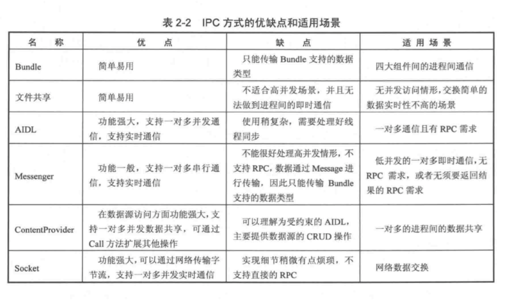

# Binder

## 多进程会造成如下的问题

1. 静态成员和单例模式完全失效
2. 线程同步机制完全失效
3. SharedPreferences 的可靠性下降
4. Application会多次创建

## Serializable 与 Parcelable
Serializable是Java中的序列化接口，其使用起来简单但是开销大，序列化和反序列化过程需要大量I/O操作。
而Parcelable是Android中的序列化方式，效率高但使用起来略麻烦。Parcelable主要用在内存序列化上。
内存序列化选择Parcelable，
对象序列化到存储设备或者序列化后通过网络传输选择Serializable

## Android中的IPC方式
1. Bundle  需要支持的序列化的类型
2. 文件共享 存在并发读写的问题，适合同步要求不高还要妥善处理并发问题
3. Messenger 进程间传递Message 底层是AIDL实现，串行处理请求，异步，object字段不支持自定义Parcelable对象
4. AIDL
5. ContentProvider 底层实现Binder
6. Socket
## RemoteCallbackList
用于跨进程注册Listener

## Binder线程池

UI线程不要调用远程方法 服务端方法已经在线程中运行，不需要再开线程

## DeathRecipient 与 onServiceDisconnected
用来监听服务端进程终止
DeathRecipient的binderDied方法在客户端的Binder线程池中回调
onServiceDisconnected在客户端UI线程中回调

## 权限验证
1. onBinder中验证 不行就返回null
2. onTransact中验证 如果失败  返回false

exp:Permission 验证
采用Uid和Pid验证 获取包名

108页

## Binder连接池

多个Binder，提高AIDL开发效率

## IPC方式的优缺点和适用场景

